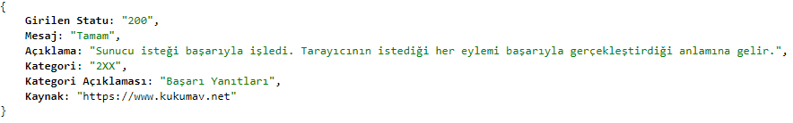

### Nedir?
Popüler HTTP statü kodları hakkında bilgi alabileceğimiz, kendimi geliştirmek için hazırladığım mini api. 

------------

### Nasıl Çalışır?
- Repoyu kendi bilgisayarına indir.
- Ana dizinde olan *newLumenDB.sql* dosyasını veritabanına import et.
- Komut satırından *composer install* komutunu çalıştır.
- Ana dizinde olan *.env* dosyasını kendi ayarlarına göre düzenle.
- Komut satırına *php -S localhost:8000 -t public* yazarak projeyi ayağa kaldır.

------------
### Fotoğraf Örneği

------------

### Denemek İçin:
`http://www.daskafa.com/api/v1/status/100`

------------

`Linkedin: https://www.linkedin.com/in/yilmazdaskafa/`